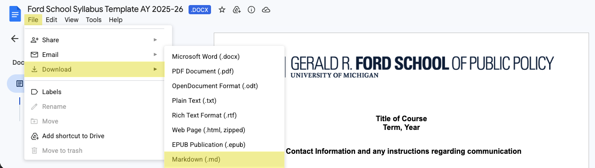

This is a Practice Course Site for Quarto Markdown

- Published website: <http://jkhanson1970.github.io/test>

## Repository Contents 

<!-- ---> 

<!-- On <https://github.com/judgelord/PP000>, click [Use this template](https://docs.github.com/en/repositories/creating-and-managing-repositories/creating-a-repository-from-a-template#creating-a-repository-from-a-template)---> 

