# Preliminaries: Limited Dependent Variables {.center}

## When $y$ Has Limited Values  

- We often have cases where $y$ is dichotomous or comes in
  nominal/ordinal categories.

- In these cases, OLS can be problematic:\

  - OLS gives continuous predicted values that may be hard to interpret.

  - OLS can give predicted values that lie outside the range of the
    dependent variable.

  - The effect of any $x_i$ on the outcome may not be linear across its
    range.

  - Heterodskedasticity is pretty much automatic.


## Maximum Likelihood Approaches 

- For dichotomous data, we have probit/logit which use different
  probability distributions but produce similar results

- For nominal data (i.e. unordered categories), we can use multinomial
  logit or probit.

- For ordinal data, we can use ordered logit or probit.

- [In general:]{.accent} interpretation is the key. It is much trickier than OLS; the coefficients do not directly tell us the magnitude of change.


## Example: Bias in Policy Professionals 

- Banuri et al. (2018) study whether policy professionals are subject to
  cognitive biases.

- e.g. confirmation bias, when people remember or prefer information
  that conforms to prior views.

- The survey sample consists of employees in the World Bank and DFID
  selected randomly and recruited via email.

- The survey contained an experiment that randomized participants into
  one of two scenarios.

- The outcome variable, measured in each scenario, is dichotomous.


## The Two Scenarios

Participants see the same data but the scenario differs:

- [Control group:]{.accent} a non-ideological scenario involving a study about the effectiveness
  of a skin cream.

- [Treatment group:]{.accent} study about the effects for the bottom 40% of the income
  distribution when localities raise the minimum wage.

- Are people in the treatment group more likely to interpret the data
  incorrectly?

- Due to ideological predisposition, people in the treatment group might
  be more inclined to see what they want in the results.


## Some Details of the Experiment

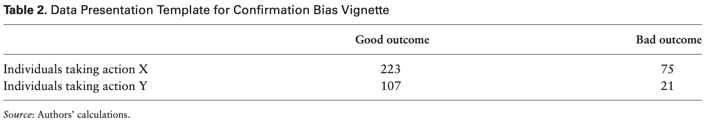{width="100%" fig-align="center" fig-alt="table shows scenario in which individuals taking action Y were more likely to have a good outcome than those taking action X"}

- The same numbers were used in both cases, but the "Good outcome" and
  "Bad outcome" labels were randomized.

- Above, the correct answer is that action Y is better, but this differs
  depending on the randomization.

- The dependent variable is 1 if the person interprets the results
  correctly, and 0 otherwise.


## Accuracy Higher in Skin Cream Scenario

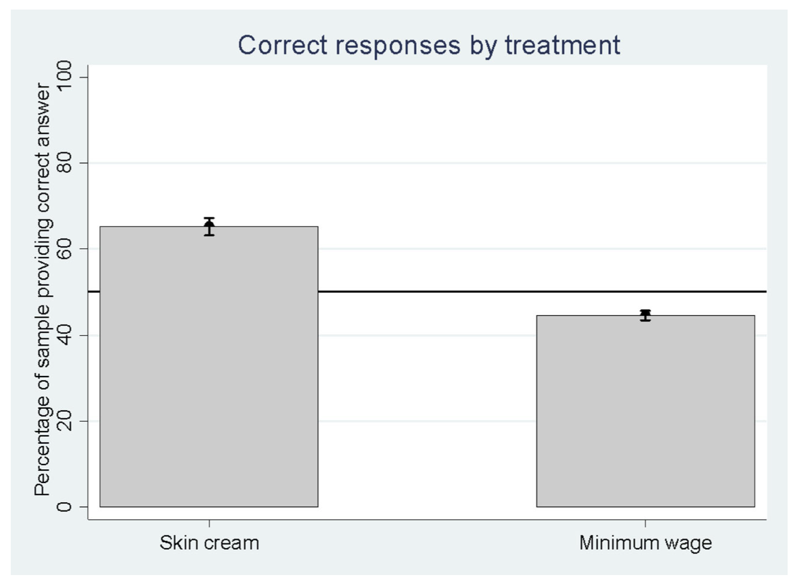{width="80%" fig-align="center" fig-alt="shows that over 60% of the people in the skin cream sample were correct, compared with less than 50% in the minimum wage sample"}


---

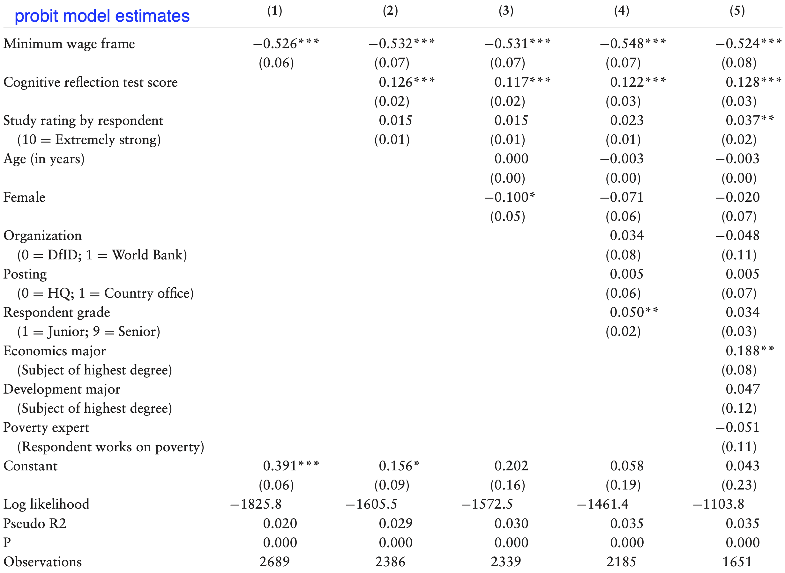{width="88%" fig-align="center" fig-alt="table 2 from the Banuri et al. article"}


# Digging In: Dichotomous Dependent Variables {.center}


## Dichotomous Data: Linear Probability Model

Actually, we could just use OLS despite a dichotomous $y$.

$$\begin{align*}
\mathop{\mathrm{E}}[y_i|\mathbf{x_i}] & = [1 \times \mathop{\mathrm{Pr}}(y_i = 1|\mathbf{x_i})] + [0 \times \mathop{\mathrm{Pr}}(y_i = 0)|\mathbf{x_i}]\\
&  = \mathop{\mathrm{Pr}}(y_i = 1|\mathbf{x_i})
\end{align*}$${alt="the expected value of y given x is equal to 1 times the probability that y equals 1 given x plus 0 times the probability that y equals 0 given x, which simplifies to just the probability that y equals 1 given x"}

We can rewrite the expected value of $y_i$ given $\mathbf{x_i}$ as: 

$$\begin{equation*}
\mathop{\mathrm{Pr}}(y_i = 1|\mathbf{x_i}) = \mathbf{x_i}\boldsymbol{\beta}
\end{equation*}$$

Where $\mathbf{x_i}$ is a $1 \times k$ row vector from the matrix $\mathbf X$, and $\boldsymbol{\beta}$ is a $k \times 1$ column vector.


## Example: Single Independent Variable

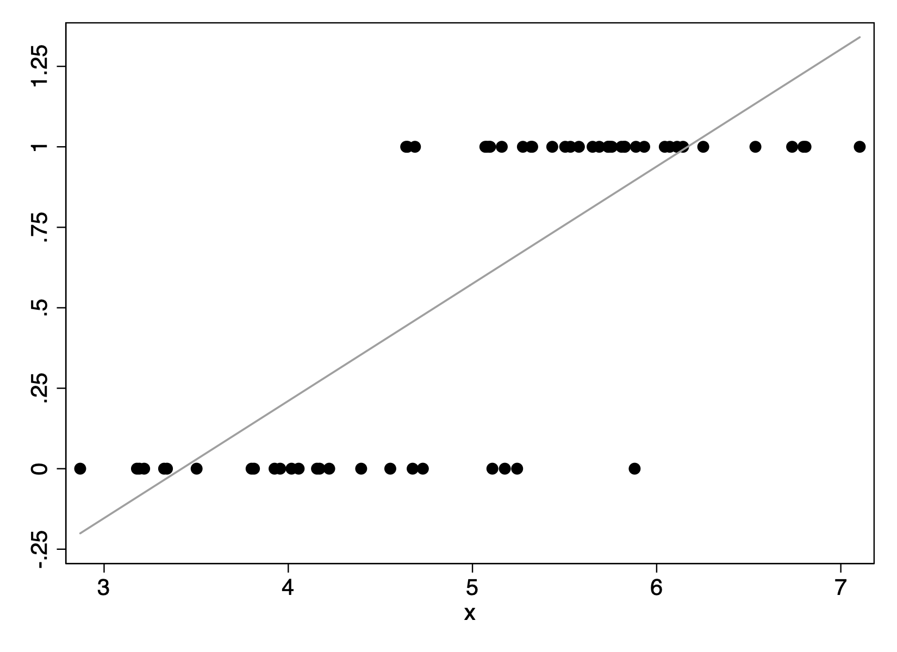{width="86%" fig-align="center" fig-alt="shows best-fit line through two horizontal rows of points as 0 and 1 for the dependent variable y"}


## Interpretation

- The interpretation is similar to OLS. Each one-unit increase in $x$
  leads to a $\beta$-sized change in the probability that $y$ equals 1.

- [Problem:]{.accent} it's unrealistic that $x$ has the same, linear effect on
  $\mathop{\mathrm{Pr}}(y_i = 1)$ regardless of its starting level.

  - the estimated effect of $x$ is biased for some values of $x$.

- [Problem:]{.accent} predictions outside the boundaries of 0 and 1 are possible.

- [Problem:]{.accent} heteroskedasticity in the prediction errors. The errors are not
  normal, either.


## Generalization to Multiple Independent Variables

$$\begin{align*}
\mathop{\mathrm{Pr}}(y_i = 1|\mathbf{x_i}) & = \mathbf{x_i}\boldsymbol{\beta}\\
& = \beta_{0} + \beta_{1}x_{1}  + \ldots + \beta_{k-1}x_{k-1} %+ \epsilon_i
\end{align*}$$

- Everything is the same. The inner product
  $\mathbf{x_i}\boldsymbol{\beta}$ is a scalar.

- We can interpret each $\beta_{k}$ as the predicted change in the
  probability that $y_{i} = 1$ associated with a one-unit change in
  $x_{k}$.

- All the same problems are still present.


## Example: 2020 Presidential Election Choice

From the 2020 American National Election Study. The dependent variable, [VotedBiden]{.accent}, equals 1 if the person voted for Biden and 0 if the person voted for
another candidate.

- [PoliticalNews:]{.accent} how closely person follows political news (0-3).

- [Ideology:]{.accent} scale from 0 (extremely liberal) to 6 (extremely conservative).

- [FauciTherm:]{.accent} feeling thermometer for Dr. Anthony Fauci (0-100).

- [BLMtherm:]{.accent} feeling thermometer for Black Lives Matter (0-100).

- [BAplus:]{.accent} person has a BA degree (1=yes; 0=no).


## Example: Biden Vote LPM

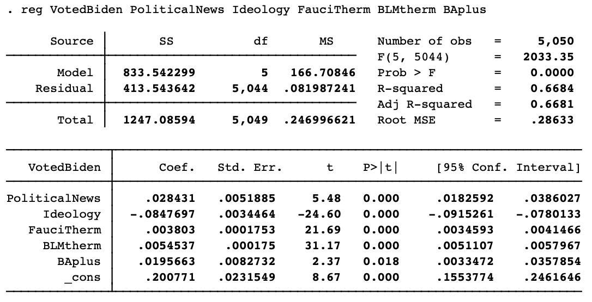{width="90%" fig-align="center" fig-alt="Stata regression output for VotedBiden"}


## Predictions Outside the Boundaries

Note that the predicted values of $y$, which can be interpreted as the
probability of voting for Biden, range beyond 0 and 1.

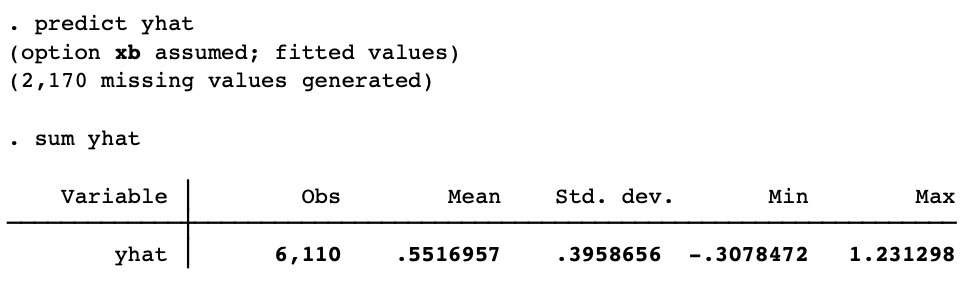{width="70%" fig-align="center" fig-alt="Stata output with summary statistics for the predicted value of y from the regression"}

This is not optimal, but it's not a huge problem either. We could just
impose bounds on these extreme predictions.


## In Defense of the LPM

- The coefficients are easy to interpret and explain.

- There are scenarios where a probit/logit cannot be estimated but an
  LPM can:

  - e.g. when an independent dummy variable is perfectly correlated with
    the outcome.

- Standard errors in a logistic model can be too small.


## The LPM Works Well in RCT Setup

- In an RCT with a dichotomous outcome, the LPM provides a consistent
  estimator of the average treatment effect. $$\begin{equation*}
  y = \beta_{0} + \beta_{1}T + \beta_{2}x
  \end{equation*}$$

- In the above, both $y$ and $T$ are dichotomous, and $\beta_{1}$ is the
  estimated treatment effect.

- Linearity doesn't matter, since $T$ has only two values. Also, $x$ is
  uncorrelated with $T$ due to random assignment.

- In this setup, the marginal effect of $T$ on average across the range
  of $x$ is the same as in a probit/logit model.


## An S-curve Offers Better Fit in Other Scenarios

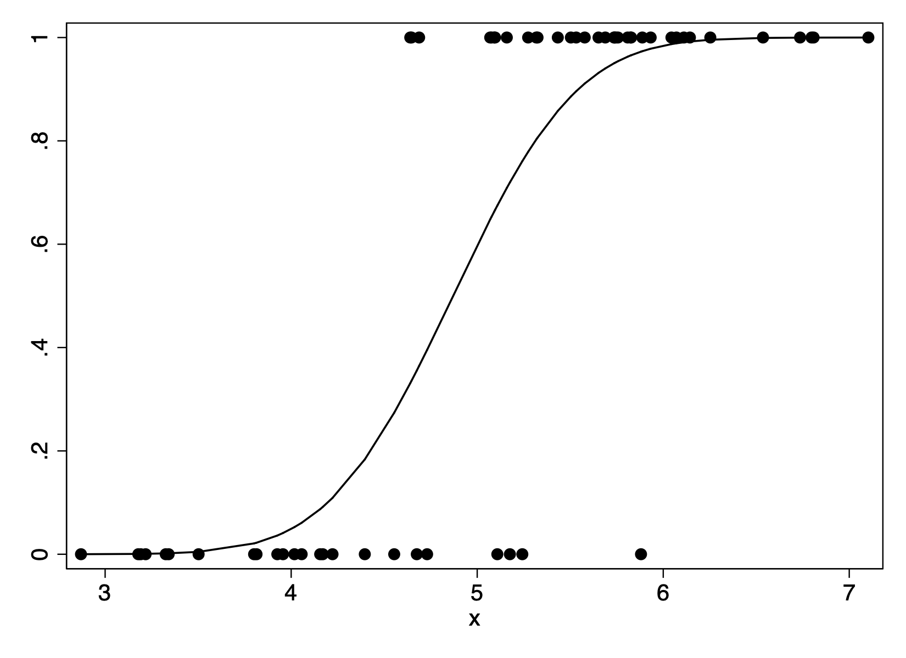{width="82%" fig-align="center" fig-alt="shows fit of s-shaped curve to the horizontal rows of points where y equals either 0 or 1"}


## Binary Response Models: Probit and Logit

- These techniques use an S-shaped curve that is bounded between 0 and 1
  to fit the data.

  - [Probit:]{.accent} based on the cumulative normal distribution.

  - [Logit:]{.accent} based on the cumulative logistic distribution.

- In both, we think of the observed, dichotomous $y$ as being generated
  by a latent, continuous variable $y^{*}$. 

  $$\begin{equation*}
    y_{i}=\begin{cases}
      1 & \text{if } y^{*}_{i} > \tau \\
      0 & \text{if } y^{*}_{i} \leq \tau
    \end{cases}
  \end{equation*}$$

- These are called link functions because they link $y^{*}$ to $y$.


## Choosing the Distribution Function

$$\begin{equation*}
y_{i}^{*} = \mathbf{x_{i}}\boldsymbol{\beta}+ \epsilon_{i}
\end{equation*}$$

- There aren't strong reasons to choose probit over logit or vice-versa.
  They yield equivalent results.

- In both, we model $y_{i}^{*}$ as a linear function of the $x_i$'s.

- With probit, we assume standard normal errors:
  $\epsilon_{i} \sim N(0,1)$

- With logit, we assume logistic errors:
  $\epsilon_{i} \sim \lambda(0,\frac{\pi^2}{3})$

  - Logit has slightly fatter tails due to the greater variance.


# Probit Analysis {.center}


## Probit: Cumulative Normal Density Function

$$\begin{equation*}
\Phi(\epsilon) = \int_{-\infty}^{\epsilon} \frac{1}{\sigma \sqrt{2\pi}} \exp \left(-\frac{(t - \mu)^{2}}{2\sigma^{2}} \right) dt
\end{equation*}$$\
which, since we assume $\mu = 0$ and $\sigma =1$, simplifies to:

$$\begin{equation*}
\Phi(\epsilon) = \int_{-\infty}^{\epsilon} \frac{1}{\sqrt{2\pi}} \exp \left(-\frac{t^{2}}{2} \right) dt
\end{equation*}$$\
Here we use the cumulative normal density to get the area under the
normal distribution up to $\epsilon$.


## Normal Density vs. Cumulative Normal

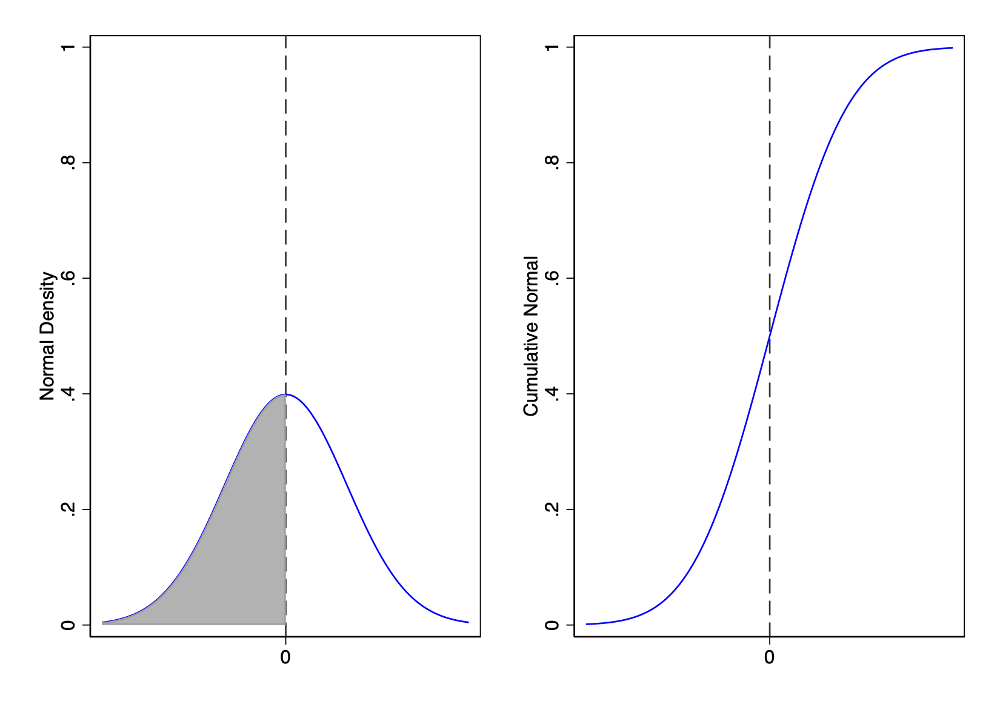{width="85%" fig-align="center" fig-alt="shows normal density function on left and cumulative normal density on right"}


## Connection to Using a z-table

- You should be familiar with looking up the area under the normal
  above/below some $z$ score.

- The cumulative standard normal density function gives the proportion
  of area below a $z$ score.

- This function evaluated at 0 is .5.

- This function evaluated at 1.96 is .975.


## Cumulative Normal Density Function

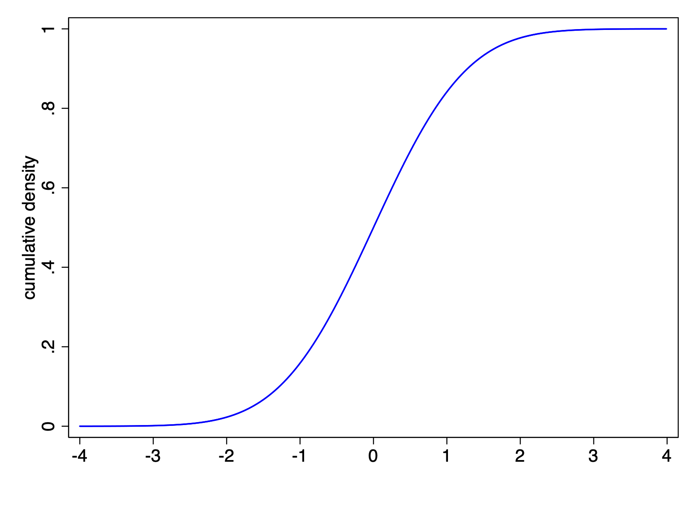{width="88%" fig-align="center" fig-alt="shows the cumulative normal distribution, making an s-curve shape"}


## The Latent Variable $y^{*}$

$y^{*}$ is a linear function of the observed $x$'s: 

$$\begin{equation*}
y_{i}^{*} = \mathbf{x_{i}}\boldsymbol{\beta}+ \epsilon_{i}
\end{equation*}$$ 

There is some threshold value of $y^{*}$ above which $y_{i}$ equals 1: 
$$\begin{equation*}
  y_{i}=\begin{cases}
    1 & \text{if } y^{*}_{i} > \tau \\
    0 & \text{if } y^{*}_{i} \leq \tau
  \end{cases}
\end{equation*}$$

We think of $y_{i}^{*}$ as being determined by
$\mathbf{x_{i}}\boldsymbol{\beta}$ plus a stochastic
component. The realization of $y_i$ is thus probabilistic to some
degree.


## 
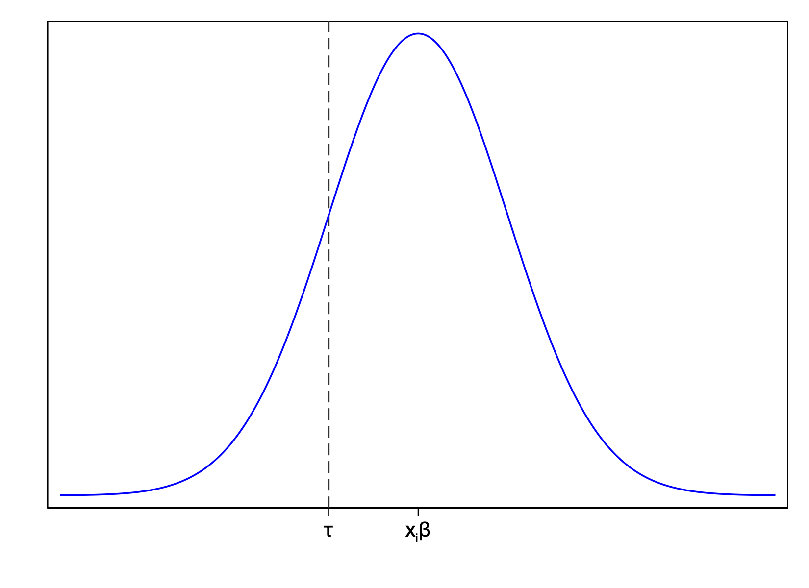{width="57%" fig-align="center" style="margin: 0; padding: 0;" fig-alt="illustrates where threshold sits compared to x Beta on standard normal distribution"}

- Since
  $y_{i}^{*} = \mathbf{x_{i}}\boldsymbol{\beta}+ \epsilon_{i}$,
  there is some probability that $y_i^* < \tau$ once $\epsilon_i$ is
  added on.

- We can use the fact that $\epsilon$ is assumed to have a standard
  normal distribution to find the area above/below the threshold.


## Probit Analysis

We use the latent variable $y^{*}$ and the cumulative normal density to
calculate $\mathop{\mathrm{Pr}}(y_{i} = 1 | \mathbf{x_{i}})$, setting
$\tau = 0$. 
$$\begin{align*}
\mathop{\mathrm{Pr}}(y = 1 | \mathbf x_{i}) & =  \mathop{\mathrm{Pr}}(y^{*} > 0 | \mathbf x_{i})\\[.2em]
    & = \mathop{\mathrm{Pr}}(\mathbf{x_{i}}\boldsymbol{\beta}+ \epsilon > 0 | \mathbf x_{i})\\[.2em]
    & = \mathop{\mathrm{Pr}}(\epsilon > -\mathbf{x_{i}}\boldsymbol{\beta}| \mathbf x_{i})\\[.2em]
    & = \mathop{\mathrm{Pr}}(\epsilon \leq \mathbf{x_{i}}\boldsymbol{\beta}| \mathbf x_{i})\\[.2em]
    & = \Phi(\mathbf{x_{i}}\boldsymbol{\beta})
\end{align*}$$ 
The probability that $y_{i}=1$ is given by the
cumulative normal distribution evaluated at the value
$\mathbf{x_{i}}\boldsymbol{\beta}$.


## Illustration

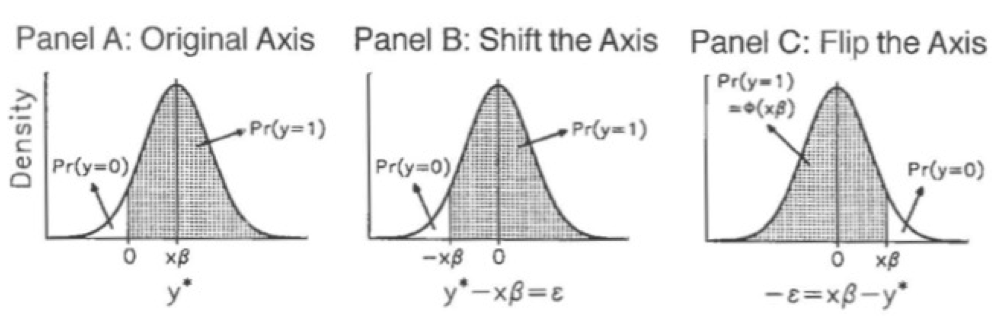{width="100%" fig-alt="illustrates why the probability that y equals 1 is represented by the area below x Beta on the standard normal"}


## Probit: Maximum Likelihood Estimation

Let $p_{i}$ be the probability of observing the value of $y_{i}$ we
observed: 
$$\begin{equation*}
  p_{i}=\begin{cases}
    \mathop{\mathrm{Pr}}(y_{i}=1 | \mathbf{x_{i}}) & \text{if } y_{i}=1 \\
    1- \mathop{\mathrm{Pr}}(y_{i}=1 | \mathbf{x_{i}}) & \text{if } y_{i}=0 
  \end{cases}
\end{equation*}$$

The likelihood function is thus: 
$$\begin{equation*}
L(\boldsymbol{\beta}| \mathbf{y}, \mathbf{X})  =  \prod_{i=1}^{N}p_{i}
\end{equation*}$$ 

We multiply together the respective probabilities of
each observed $y_{i}$


## Log Likelihood Function

$$\begin{align*}
L(\boldsymbol{\beta}| \mathbf{y}, \mathbf{X}) & = \prod_{i=1}^{N}p_{i}\\
 & = \prod_{y=1}\mathop{\mathrm{Pr}}(y_{i} =1|\mathbf{x_{i}}) \prod_{y=0}[1 - \mathop{\mathrm{Pr}}(y_{i} =1|\mathbf{x_{i}})]\\
 & = \prod_{y=1} \Phi(\mathbf{x_{i}}\boldsymbol{\beta}) \prod_{y=0}[1 - \Phi(\mathbf{x_{i}}\boldsymbol{\beta})]\\
\end{align*}$$

Which makes the log likelihood function:
$$\begin{equation*}
\ln L(\boldsymbol{\beta}| \mathbf{y}, \mathbf{X}) = \sum_{y=1} \ln \Phi(\mathbf{x_{i}}\boldsymbol{\beta}) + \sum_{y=0}\ln[1 - \Phi(\mathbf{x_{i}}\boldsymbol{\beta})]
\end{equation*}$$


## Estimation of a Probit

- The MLE finds the values of the parameters
  $\boldsymbol{\beta}$ that maximize the given log
  likelihood.

- We get a set of coefficients just like usual. The interpretation is
  different, however.

- Stata: `probit y x1 x2 x3`

- R:
  ```model <- glm(y ~ x1 + x2 + x3, family = binomial(link = "probit"), data = mydata)```


## Stata Probit Example

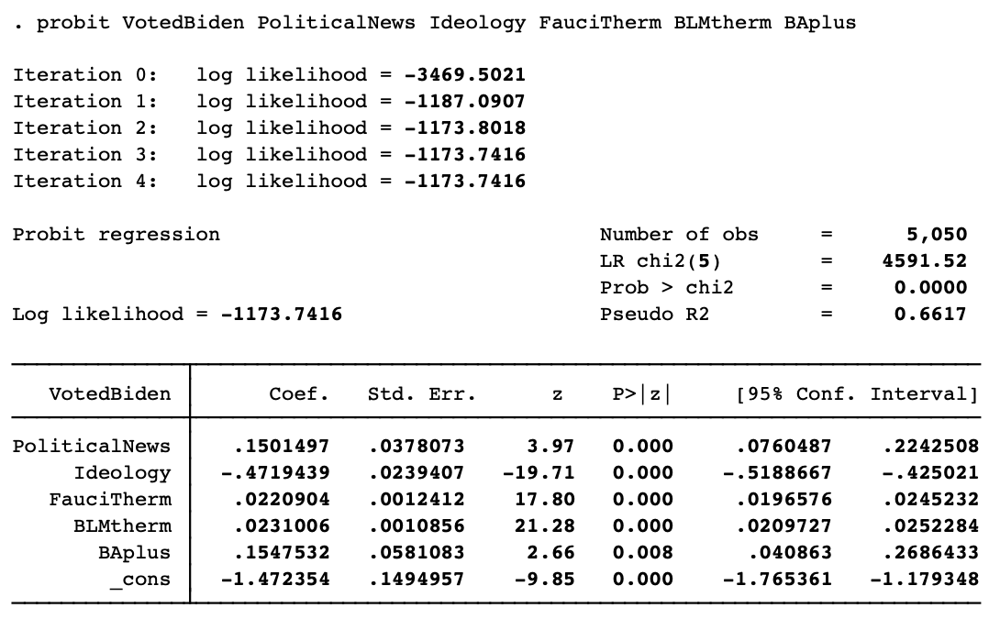{width="88%" fig-align="center" fig-alt="Stata output from the probit model for VotedBiden"}


## R Probit Example

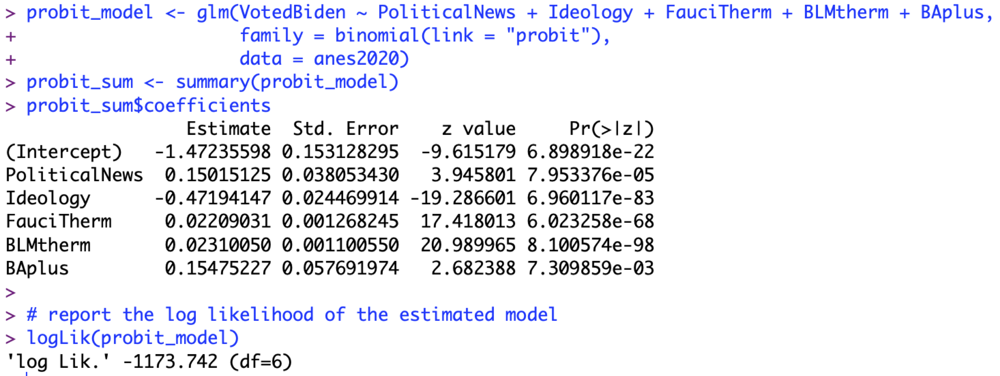{width="100%" fig-align="center" fig-alt="R output from the probit model for VotedBiden"}


## Interpretation of Coefficients

- The sign of the coefficient indicates the direction of the
  relationship between the $x$'s and $\mathop{\mathrm{Pr}}(y_i=1)$.

- To understand the magnitude of the effect, we must determine by how
  much $\Phi(\mathbf{x_i}\boldsymbol{\beta})$ changes
  in response to a particular $x_i$.

- This effect depends upon the values of all the variables in the
  analysis, since the starting point on the S-shaped curve matters.

- There is no direct way to interpret the magnitude of the change in
  probability due to change in a single $x_i$ without considering the
  values of the other $x_i$'s.


## Different Ways to Interpret Probit Results

- [Predicted Probability.]{.accent} Calculate $\mathop{\mathrm{Pr}}(y_i=1)$ given the values of the
  $x$'s for a particular case of interest.

- [Change in Predicted Probability.]{.accent} Calculate the change in $\mathop{\mathrm{Pr}}(y_i=1)$ when $x$'s
  change from one set of values to another.

- [Marginal Effect.]{.accent} The predicted effect on $\mathop{\mathrm{Pr}}(y_i=1)$ from changing
  one $x_{i}$, starting at specified values for the $x$'s.

- [Average Marginal Effect.]{.accent} The average effect on $\mathop{\mathrm{Pr}}(y_i=1)$ from changing
  one $x_{i}$, calculated across all the cases in the sample.

  - Each case is evaluated at its own values for the $x$'s.


## Calculating a Predicted Probability

The probability of a vote for Biden is
$\Phi(\mathbf{x_i}\boldsymbol{\beta})$. If
`PoliticalNews`=2, `Ideology`=3, `FauciTherm`=65, `BLMtherm`=60, and
`BAplus`=1 then: 

$$\begin{align*}
\mathbf{x_i}\boldsymbol{\beta}& = -1.472 + .150(\text{PoliticalNews}) - .472(\text{Ideology})\\
&  + .022(\text{FauciTherm}) + .023(\text{BLMtherm}) + .155(\text{BAplus})\\[.4em]
 & = -1.47 + .15(2) - .472(3) + .022(65) + .023(60) + .155(1)\\[.4em]
  & = .377
\end{align*}$$

To find the probability that a person with the above characteristics
voted for Biden, evaluate using the cumulative normal distribution:
$\Phi(.377) = .65$.


## Evaluating Cumulative Normal with Software

$\Phi(\mathbf{x_i}\boldsymbol{\beta})$ is the area
under the normal density up to the point
$\mathbf{x_i}\boldsymbol{\beta}$. We can find it in
these ways:

- Stata: ` display normal(xB)`

- R: ` pnorm(xB)`

- Excel: ` =NORM.DIST(xB, 0, 1, TRUE)`

Where xB is the value of the point we want to evaluate:
$\mathbf{x_i}\boldsymbol{\beta}$


## Commands for Predicted Values

- The `margins` command in Stata can calculate predicted probabilities
  or the value of $\mathbf{x_i}\boldsymbol{\beta}$.

- The default option for `predict` is the predicted probability. Add
  `xb` in the parentheses to get
  $\mathbf{x_i}\boldsymbol{\beta}$ instead.

  - `margins, predict() at(var1=3 var2=10 var3=25)`

  - `margins, predict(xb) at(var1=3 var2=10 var3=25)`

- The value of each independent variable must be specified. For each
  `var`, you must use the name of a variable in the model.

- For R, the `marginaleffects` library provides the `predictions`
  function.


## Use of Margins for Predicted Probabilites

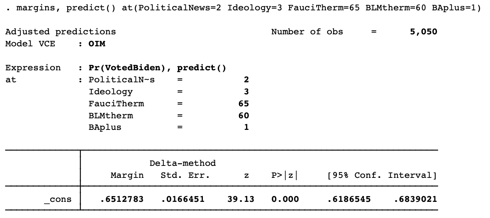{width="100%" fig-align="center" fig-alt="Stata output for margins predict p-hat"}


## Use of Margins for $\mathbf{x_i}\boldsymbol{\beta}$

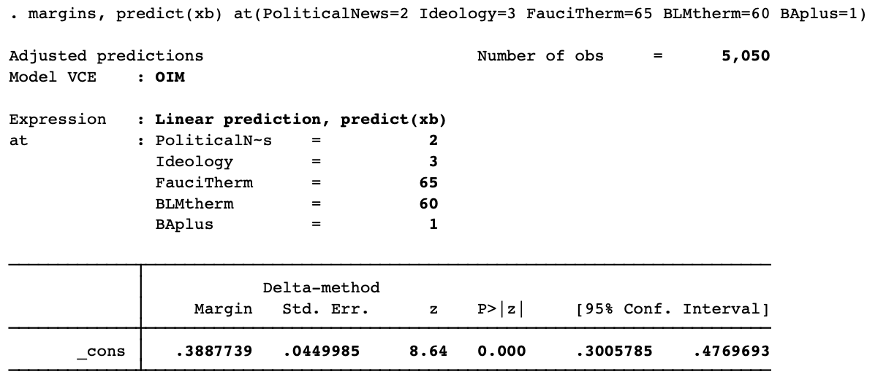{width="100%" fig-align="center" fig-alt="Stata output for margins predict x Beta"}


## Predicted Probabilites in R

Using the `predictions` function from the `marginaleffects` library.

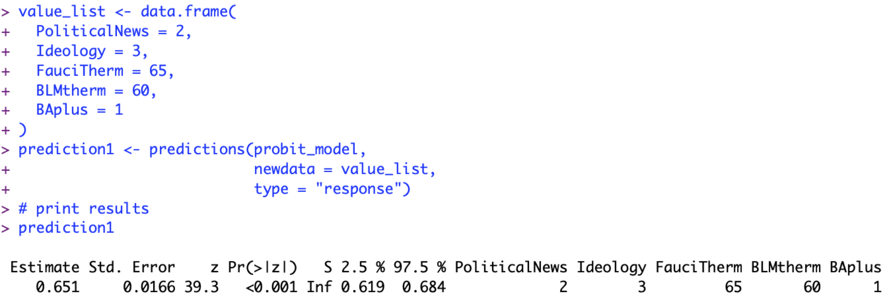{width="100%" fig-align="center" fig-alt="R output for margins predict y hat"}


## Obtain Predicted Probabilities for Each Case

- In Stata, one can also obtain the predicted probabilities for each
  case in the sample with the `predict` command.

- `predict phat`

- This creates a new variable in the dataset called `phat`. It contains
  the probability that each case is 1 on the dependent variable.

- In R, the `fitted.values()` function gives predicted probabilities for
  each case in the sample.

- `phat <- fitted.values(model)`


## Finding the Effect of $\Delta x_k$

- Let the initial predicted value be
  $\mathbf{x_{i}}\boldsymbol{\beta}$.

- Then, by changing $x_k$ to some new value, we can calculate
  $\mathbf{\tilde{x}_{i}}\boldsymbol{\beta}$.

- The predicted effect of the change in $x_k$ on
  $\mathop{\mathrm{Pr}}(y_i = 1)$ is given by: $$\begin{equation*}
   \Phi(\mathbf{\tilde{x}_{i}}\boldsymbol{\beta}) - \Phi(\mathbf{x_{i}}\boldsymbol{\beta})
  \end{equation*}$$

- The values of all the variables in the analysis are relevant.


## Example

Previously we found that the probability of a Biden vote is .65. What if
we change `Ideology` from 3 to 5?

$$\begin{align*}
\mathbf{x_i}\boldsymbol{\beta}& = -1.472 + .150(\text{PoliticalNews}) - .472(\text{Ideology})\\
&  + .022(\text{FauciTherm}) + .023(\text{BLMtherm}) + .155(\text{BAplus})\\[.1em]
 & = -1.47 + .15(2) - .472(5) + .022(65) + .023(60) + .155(1)\\[.1em]
  & = -.567
\end{align*}$$

Since $\Phi(-.567) = .29$, we can calculate the effect
of the change in `Ideology` like this: $$\begin{equation*}
 \Phi(-.567) - \Phi(.377)= .29 - .65 \ = \ -.36
\end{equation*}$$
The probability of a Biden vote falls by .36 to .29.


## The Size of the Effect Depends

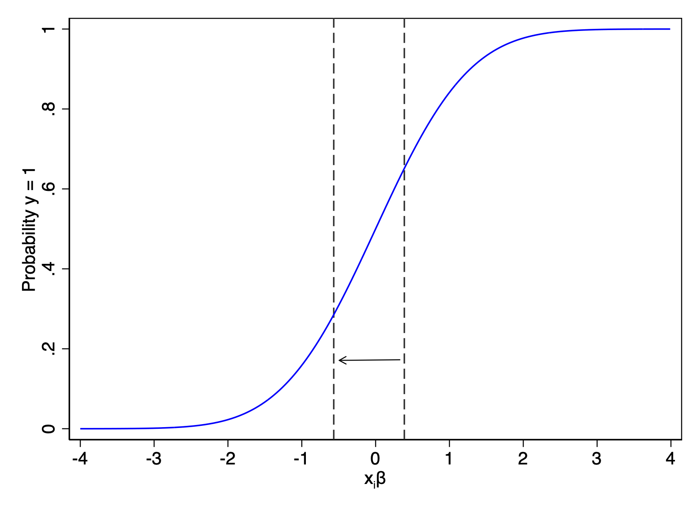{width="85%" fig-align="center" fig-alt="shows how change in x beta translates into change in predicted probility across s-curve"}


## Predicted Probabilities Across Range of $x_k$

- In Stata, we can use the `margins` command to get predicted
  probabilities across the range of a variable.

- All the other variables must be set to some value.

- The format is:\
  `margins, predict() at(x1=2 x2=(2(1)10) x3=4)`

- In this example, the variable $x_2$ is set to range from 2 to 10 in
  increments of 1 unit.

- Follow this command with the command `marginsplot` to graph the
  results.


## Predicted Probabilities Over a Range of $x_k$

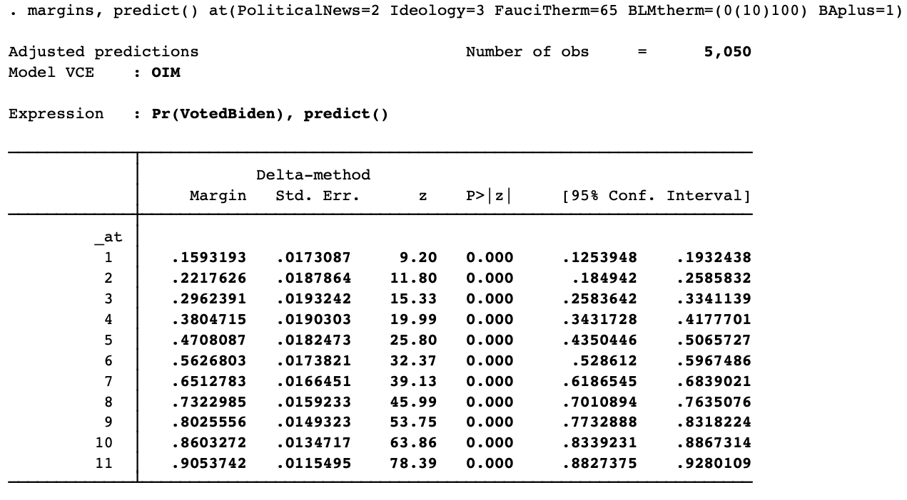{width="95%" fig-align="center"}


## The Resulting Graph

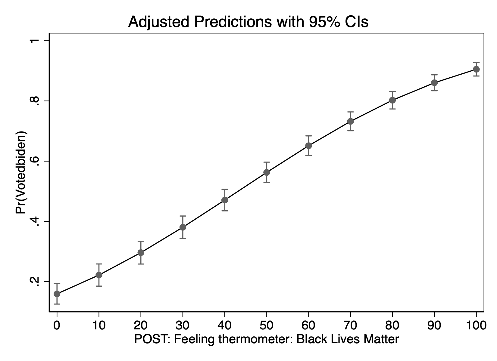{width="85%" fig-align="center" fig-alt="figure from Stata illustrating how marginal effect of BLM therm changes over its range"}


## In R, using the `marginaleffects` library

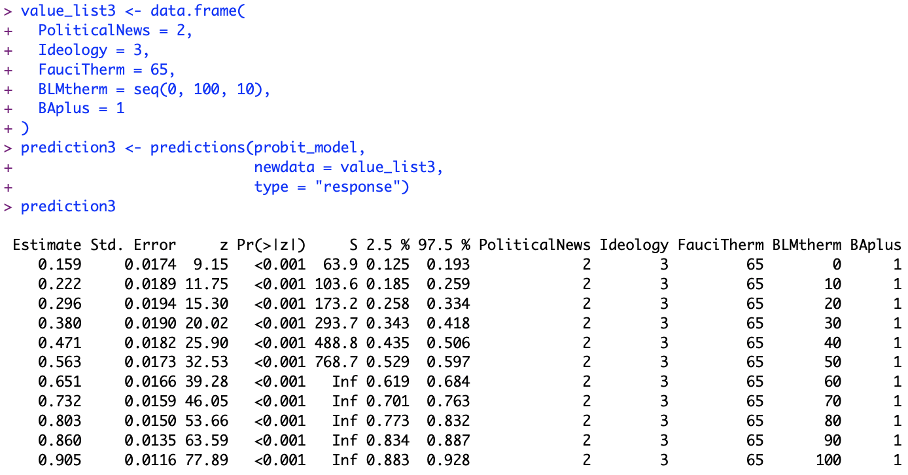{width="90%" fig-align="center" fig-alt="code and output from R for marginal effect of BLM therm across its range"}

See the example code to make the marginsplot.


## Marginal Effect of $x_k$ {footer="false"}

As with OLS, we can find the marginal effect of $x_k$ by taking the
derivative with respect to $x_k$. $$\begin{equation*}
\frac{\partial \mathop{\mathrm{Pr}}(y=1|\mathbf{x})}{\partial x_k} = \frac{\partial \Phi(\mathbf{x_i}\boldsymbol{\beta})}{\partial x_k} = \phi(\mathbf{x_i}\boldsymbol{\beta})\beta_k
\end{equation*}$$
where $\phi(\mathbf{x_i}\boldsymbol{\beta})$ is the
normal probability density function (note: [this is not the cumulative density function!]{.accent}).

- For the example case when `Ideology`=3, $\phi(.377)=.372$.

- Recall that the coefficient on `Ideology` is -.472.

- Since $(.372)(-.472)  = -.176$, the marginal effect of a one-unit
  change in `Ideology` is about -.18 for $x$'s set at these values.


## Commands for Normal Probability Density

For the marginal effect, we are not using the *cumulative* density
function but just the standard normal probability density.

In other words, we want the height of the normal curve at
$\mathbf{x_i}\boldsymbol{\beta}$ rather than the area
below $\mathbf{x_i}\boldsymbol{\beta}$.

- Stata: `display normalden(xB)`

- R: `dnorm(xB, mean = 0, sd = 1)`

- Excel: `=NORM.DIST(xb, 0, 1, FALSE)`

Where `xB` is the value of the point that we want to evaluate:
$\mathbf{x_i}\boldsymbol{\beta}$


## Use of `margins` for a Marginal Effect

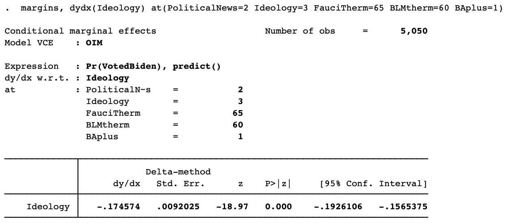{width="90%" fig-align="center" fig-alt="Stata output from the margins command for the average marginal effect of Ideology"}

For R, see example code for the `slopes()` function in the
`marginaleffects` library.


## Marginal Effect Across Range of $x_k$

- Crucially, since we have a non-linear model, the marginal effect of
  $x_i$ changes as the value of $x_k$ changes.

- This is a key difference with OLS.

- The `margins` command can calculate these marginal effects across the
  range of $x_k$ and then graph them with `marginsplot`.

- `margins, dydx(x2) at(x1=2 x2=(2(1)10) x3=4)`

- `marginsplot`


## Marginal Effects Across the Range of Ideology

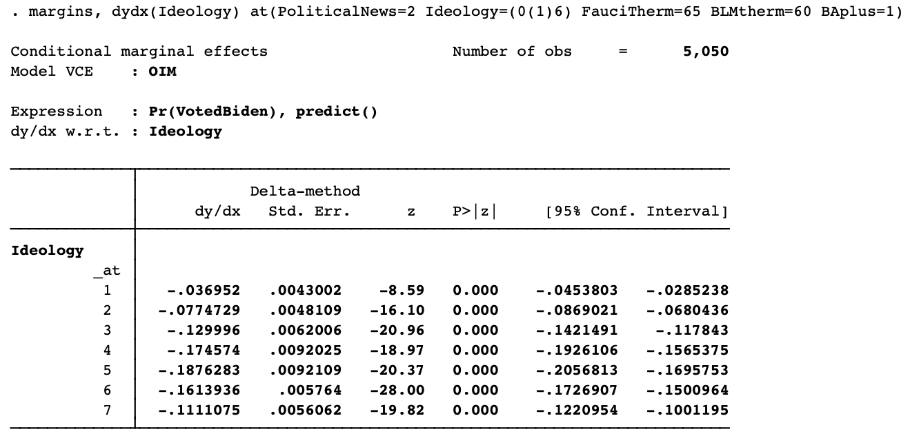{width="100%" fig-align="center" fig-alt="Stata output from margins showing marginal effect of Ideology across its range"}


## Marginal Effects Across the Range of Ideology

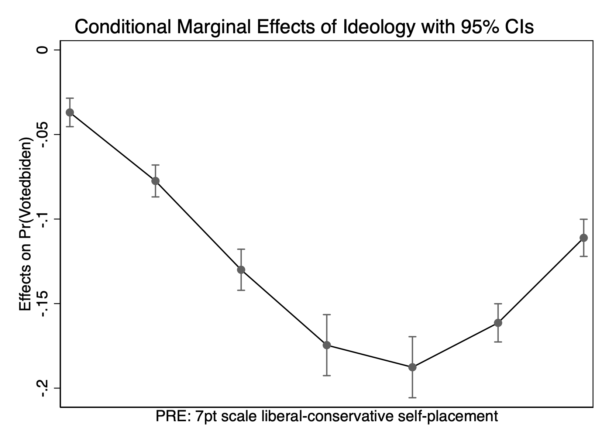{width="80%" fig-align="center" fig-alt="Stata's marginsplot"}


## Marginal Effects Across the Range of Ideology

Using the `marginaleffects` library in R:

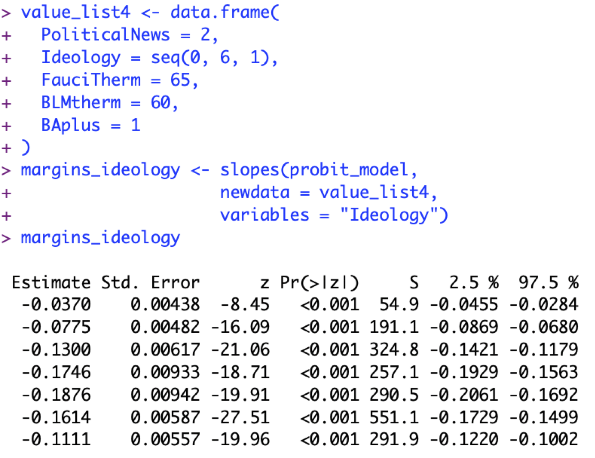{width="70%"  fig-align="center" fig-alt="R code for marginal effect of Ideology across its range"}


## Average Marginal Effect of Ideology

This is the mean change in Pr(Biden) across the cases in the sample from
increasing `Ideology` by 1, holding all else constant.

{width="88%" fig-align="center" fig-alt="Stata output for margins dydx of ideology"}

In R: `avg_slopes(probit_model, variables = "Ideology")`


## Measures of Fit

- In OLS, typical measures of the model's fit include the $F$-statistic
  and the $R^2$ statistic.

- For probit analysis, the correlate to the $F$-test is a likelihood
  ratio (LR) test. The idea is the same: the null hypothesis is that all
  coefficients are zero.

- The "pseudo-$R^2$" measure should be treated with caution. It's not
  that useful a statistic.

- What would be better? The percentage of cases predicted correctly. Use
  the `estat` command.


## The Likelihood Ratio (LR) Test

- The test involves a comparison of the likelihood of the estimated
  model to the likelihood of a restricted model.

- In the restricted model, the coefficients on the $x_i$'s are
  restricted to 0. This is an intercept-only model (Iteration 0 in the
  MLE).

- A statistically significant increase in the likelihood in the
  unrestricted model means that the $x_i$'s have explanatory power.
  $$\begin{equation*}
  LR = -2 \ln\left(\frac{L_r}{L_{ur}}\right) = -2(\ln L_r - \ln L_{ur})
  \end{equation*}$$

- The LR statistic has a $\chi^2$ distribution with degrees of freedom
  equal to the number of restricted coefficients.


---

$LR = -2(\ln L_r - \ln L_{ur}) = -2(-3469.50 - (-1173.74)) = 4591.52$

{width="86%" fig-alt="Stata probit esimation output for VotedBiden model"}

Pseudo-$R^{2}$ is not a great measure of fit. Avoid it.


## LR Test for Joint Significance

- We can also use an LR test to determine whether two or more
  coefficients are jointly significant.

- For the restricted model, obtain the final log likelihood of the model
  estimated without including these $x_i$'s.

- For the unrestricted model, use the final log likelihood of the full
  model. $$\begin{equation*}
  LR = -2(\ln L_r - \ln L_{ur})
  \end{equation*}$$

- The LR statistic has a $\chi^2$ distribution with degrees of freedom
  equal to the number of restricted coefficients.


---

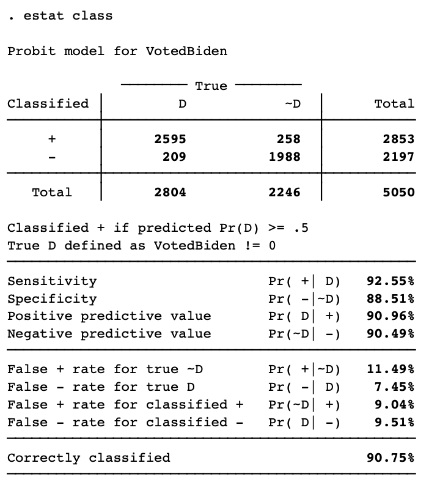{width="57%" fig-align="center" fig-alt="Stata output for estat class following probit"}


# Logit Analysis {.center}


## Logit Analysis

- The setup is very similar to that of Probit analysis, but it uses the
  cumulative standard logistic distribution. $$\begin{equation*}
  \mathop{\mathrm{Pr}}(y_i = 1|\mathbf{x_{i}}) = \Lambda (\mathbf{x_{i}}\boldsymbol{\beta}) = \frac{\exp(\mathbf{x_{i}}\boldsymbol{\beta})}{1 + \exp(\mathbf{x_{i}}\boldsymbol{\beta})}
  \end{equation*}$$

- We assume $\epsilon_i$ has a logistic distribution with mean 0 and
  variance $\pi^{2}/3$.

- $\Lambda (\mathbf{x_{i}}\boldsymbol{\beta})$ gives
  the area up to the point
  $\mathbf{x_{i}}\boldsymbol{\beta}$ in the cumulative
  standard logistic distribution.


## Normal vs. Logistic Densities

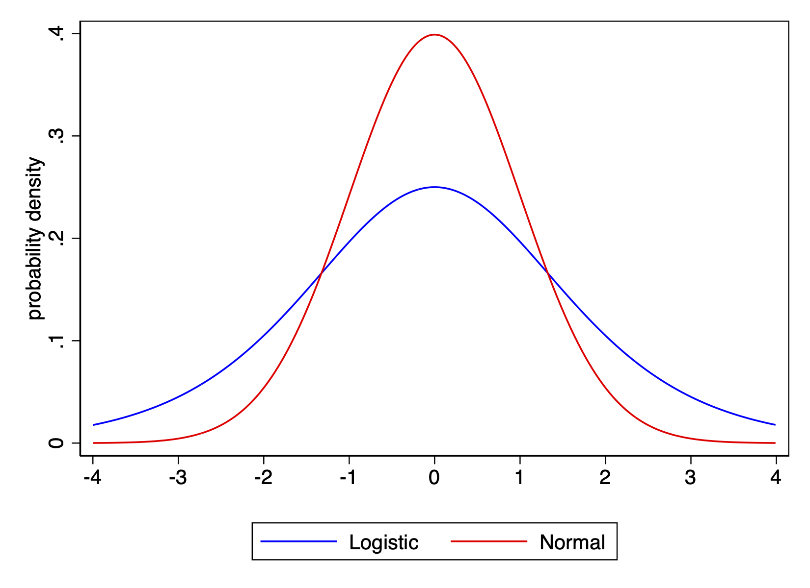{width="86%" fig-align="center" fig-alt="shows shape of logistic and normal density functions"}


## Cumulative Normal vs. Cumulative Logistic

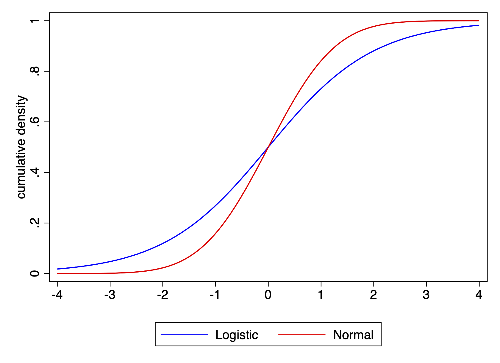{width="86%" fig-align="center" fig-alt="shows cumulative normal distribution compared with cumulative logistic distribution"}


## Basics of Logit

- An odds ratio is the probability of an outcome divided by its
  complement (i.e. the probability that it will not happen).

- Logit uses the log of odds ratio for modeling $y^*$
  $$\begin{equation*}
  \ln \left(\frac{p_i}{1-p_i}\right) = \mathbf{x_{i}}\boldsymbol{\beta}+ \epsilon_{i}
  \end{equation*}$$

- The odds ratio is: $\frac{p_i}{1-p_i}$. Taking the natural log makes
  it linear.

- The coefficients thus give us changes in the log odds ratio. We can
  convert this into changes into predicted probabilities.


## Math Note

Given that: $$\begin{align*}
\mathbf{x_{i}}\boldsymbol{\beta}+ \epsilon_{i} & = \ln \left(\frac{p_i}{1-p_i}\right)\\
\exp(\mathbf{x_{i}}\boldsymbol{\beta}+ \epsilon_{i}) & = \frac{p_i}{1-p_i}
\end{align*}$$ Then, $$\begin{align*}
\frac{\exp(\mathbf{x_{i}}\boldsymbol{\beta})}{1 + \exp(\mathbf{x_{i}}\boldsymbol{\beta})} & = \frac{\frac{p_i}{1-p_i}}{1 + \frac{p_i}{1-p_i}} \ = \ \frac{\frac{p_i}{1-p_i}}{\frac{1-p_{i}}{1-p_{i}} + \frac{p_i}{1-\hat{p}_i}} \ = \ \frac{\frac{p_i}{1-p_i}}{\frac{1}{1-p_i}} \ = \ p_{i}\\
\end{align*}$$


## Estimating Logit Models

- Stata: `logit y x1 x2 x3`

- R: `model <- glm(y ~ x1 + x2 + x3, family = binomial(link =
  "logit"), data = mydata)`

- R: the function `plogis(w)` gives the cumulative logistic distribution
  at point $w$.


## Logit Results from Same Example

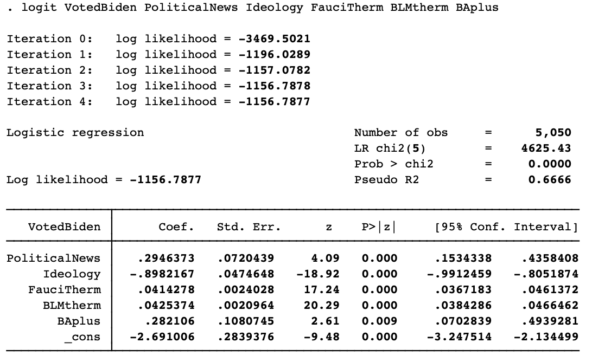{width="88%" fig-align="center" fig-alt="Stata output from logit model with VotedBiden"}


## Example Interpretation (Logit)

The probability of a vote for Biden is
$\Lambda(\mathbf{x_i}\boldsymbol{\beta})$. If
`PoliticalNews`=2, `Ideology`=3, `FauciTherm`=65, `BLMtherm`=60, and
`BAplus`=1: $$\begin{align*}
\mathbf{x_i}\boldsymbol{\beta}& = -2.691 + .295(\text{PoliticalNews}) - .898(\text{Ideology})\\
&  + .041(\text{FauciTherm}) + .043(\text{BLMtherm}) + .282(\text{BAplus})\\[.4em]
 & = -2.269 + .295(2) - .898(3) + .041(65) + .043(60) + .281(1)\\[.4em]
  & = .733
\end{align*}$$

Finally, evaluate using the cumulative logistic distribution:
$\Lambda(.733) = .68$. Recall that for probit it was .65.


## Predicted Probabilities in More Detail

Let
$\mathbf{x_i}\boldsymbol{\beta}= \beta_{0} + \beta_{1} x_{1} + \beta_{2}x_{2}$
$$\begin{align*}
\Lambda(\mathbf{x_i}\boldsymbol{\beta}) & = \Lambda(\beta_{0} + \beta_{1} x_{1} + \beta_{2}x_{2})\\[.75em]
    & =  \frac{\exp(\beta_{0} + \beta_{1} x_{1} + \beta_{2}x_{2})}{1 + \exp(\beta_{0} + \beta_{1} x_{1} + \beta_{2}x_{2})}
\end{align*}$$


## Finding the Effect of $\Delta x_k$

- Quite similar to probit, the predicted effect of the change in $x_k$
  on $\mathop{\mathrm{Pr}}(y_i = 1)$ is given by: $$\begin{equation*}
   \Lambda(\mathbf{\tilde{x}_{i}}\boldsymbol{\beta}) - \Lambda(\mathbf{x_{i}}\boldsymbol{\beta})
  \end{equation*}$$

- The values of all the variables in the analysis are relevant.


## Example

Previously we found that the probability of a Biden vote is .68. What if
we change `Ideology` from 3 to 5? $$\begin{align*}
\mathbf{x_i}\boldsymbol{\beta}& = -2.691 + .295(\text{PoliticalNews}) - .898(\text{Ideology})\\
&  + .041(\text{FauciTherm}) + .043(\text{BLMtherm}) + .282(\text{BAplus})\\[.4em]
 & = -2.269 + .295(2) - .898(5) + .041(65) + .043(60) + .281(1)\\[.4em]
  & = -1.063
\end{align*}$$ Since $\Lambda(-1.063)$= .26, we can calculate the
effect of the specified change in `Ideology`: $$\begin{equation*}
 \Lambda(-1.063) - \Lambda(.733)= .26 - .68 \ = \ -.42
\end{equation*}$$

The probability of a Biden vote falls by .42 to .26.


## Marginal Effect of $x_k$

$$\begin{equation*}
\frac{\partial \mathop{\mathrm{Pr}}(y=1|\mathbf{x_i})}{\partial x_k} = \frac{\partial \Lambda(\mathbf{x_i}\boldsymbol{\beta})}{\partial x_k} = \lambda(\mathbf{x_i}\boldsymbol{\beta})\beta_k
\end{equation*}$$\
where $\lambda(\mathbf{x_i}\boldsymbol{\beta})$ is the
logistic probability density function. $$\begin{equation*}
\lambda(\mathbf{x_i}\boldsymbol{\beta}) = \frac{\exp(\mathbf{x_i}\boldsymbol{\beta})}{[1 + \exp(\mathbf{x_i}\boldsymbol{\beta})]^2}
\end{equation*}$$

For the example case: when `Ideology`=3, $\lambda(.733)=.219$.\
Since $(.219)(-.898) = -.20$, the marginal effect of `Ideology` is -.20
when the $x$'s are set to the stated values.


## Interpretation with Odds Ratios

The logit model can be written such that: $$\begin{equation*}
\ln \Omega(x) = \mathbf{x_i}\boldsymbol{\beta}
\end{equation*}$$\
where $\Omega(x)$ is the odds of an event given $x$: $$\begin{equation*}
\Omega(x) = \frac{\mathop{\mathrm{Pr}}(y=1|x)}{\mathop{\mathrm{Pr}}(y=0|x)}
\end{equation*}$$\
$\ln \Omega(x)$ is the thus the log of the odds ratio.


## About Odds Ratios

::: {#default style="font-size: 0.9em;"}
  ------------- --------------------- -------------------------
   Probability          Odds                    Logit
      $\pi$      $\frac{\pi}{1-\pi}$   $\ln \frac{\pi}{1-\pi}$
       .01          1/99 = .0101                -4.60
       .05          5/95 = .0526                -2.94
       .10           1/9 = .1111                -2.20
       .30           3/7 = .4286                -0.85
       .50             5/5 = 1                  0.00
       .70           7/3 = 2.332                0.85
       .90             9/1 = 9                  2.20
       .95            95/5 = 19                 2.94
       .99            99/1 = 99                 4.60
  ------------- --------------------- -------------------------
:::
[]{#default label="default"}


## Visual Representation

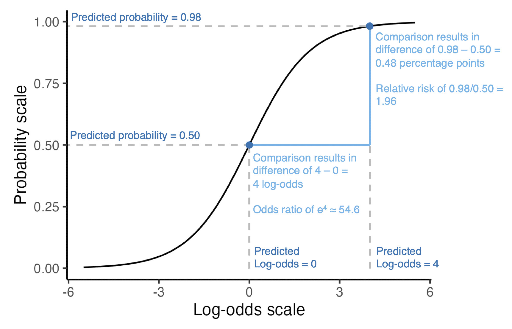{width="100%" fig-alt="shows relationship between log-odds scale and probability scale"}


## Interpretation with Odds Ratios

Since the model in linear in $\beta_{k}$: $$\begin{equation*}
\frac{\partial \ln \Omega(x)}{\partial x_{k}} = \beta_{k}
\end{equation*}$$

- A one-unit change in $x_{k}$ is associated with a $\beta_{k}$ change
  in the *log odds* ratio.

- Thus, a one-unit change in $x_{k}$ is associated with an
  $\exp(\beta_{k})$ change in the odds ratio.

- If $\exp(\beta_{k}) >1$, the odds are $\exp(\beta_{k})$ times larger.
  If $\exp(\beta_{k}) <1$, the odds are $\exp(\beta_{k})$ times smaller.


## Logistic Regression

- We can get the coefficients reported as the changes in the odds ratios
  using the `logistic` command, rather than `logit`.

- In other words, where `logit` gives us $\beta_{k}$, `logistic` will
  give us a coefficient that equals $\exp(\beta_{k})$.

- If we use the `logistic` command but add the option `coef`, we get the
  same coefficients as the `logit` command.


## Logistic Regression with Odds Ratios

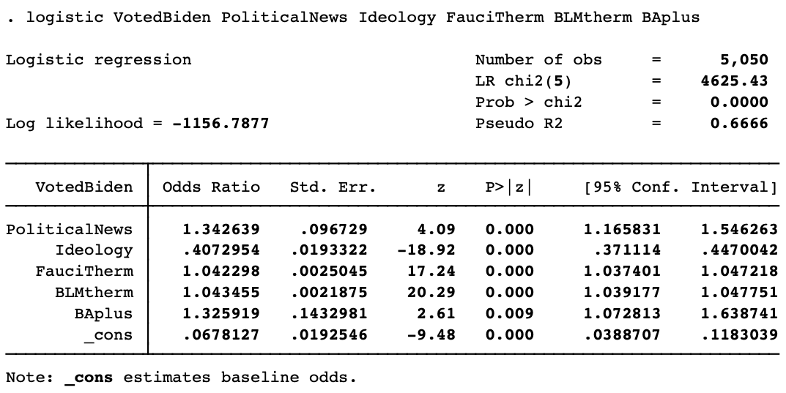{width="90%" fig-align="center" fig-alt="Stata output from logistic regression"}

A one-unit increase in `Ideology` is associated with decreasing the odds
of voting for Biden by a factor of .4073.


## Key for Interpretation

- Odds ratios can never be negative. Rather than be centered around 0,
  they are centered around 1.

- Why? Because if a ratio is multiplied by 1, it does not change.

- Thus, a variable has a negative effect on the odds of the outcome if
  the change in the ratio is less than 1.

- A variable has a positive effect if the odds ratio changes by a factor
  greater than 1.


## Example

- Suppose the initial odds of a person voting for Biden are 7 to 3. That
  is an odds ratio of 2.333 and a probability of $\frac{7}{7 + 3}$ or
  .70.

- If Ideology increases by 1, the odds ratio would change by a factor of
  .4073, making it $(2.333)(.4073) = .9052$.

- That's odds of .9052 to 1, which is about .48 in probability terms:
  $$\begin{equation*}
  \frac{.9052}{.9052 + 1} \approx .48
  \end{equation*}$$

- Predicted probabilities are probably easier to interpret, but some
  disciplines (e.g. public health) tend to use odds ratios.


## Advice

- Within the same model, odds ratios do have some value in communicating
  relative risk for different groups.

- Even in fields like health research, however, the use of odds ratios
  is under question (e.g. article by Norton et al.).

- Odds ratios are not comparable across different models or studies.

- Predicted probabilities and marginal effects are much more
  understandable to most audiences.


## Concluding Points

- With dichotomous dependent variables, both the LPM and probit/logit
  models have virtues.

- Probit/logit models are better for unbiased predictions of marginal
  effects for specific hypothetical cases.

- The LPM offers easier interpretation of coefficients.

- When RCTs have a dichotomous DV, the LPM is just fine.

